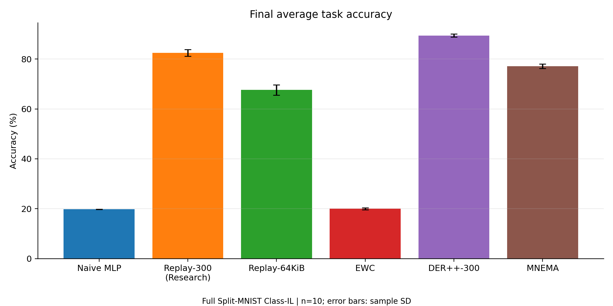
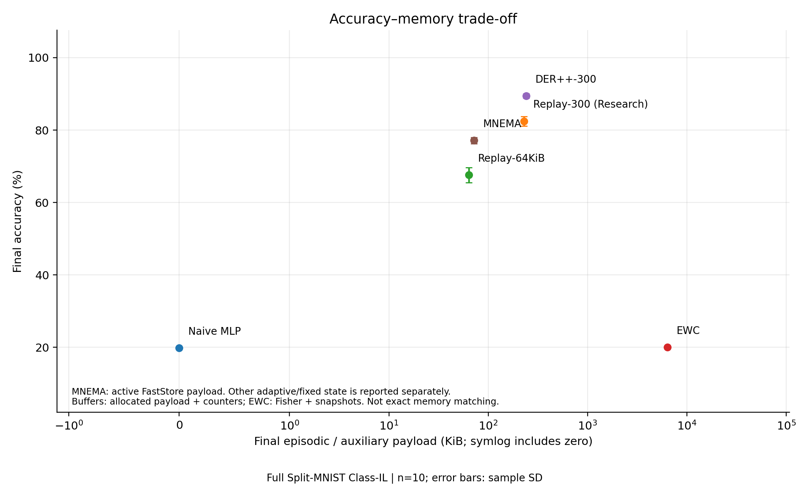

# MNEMA

**Memory-Native Event-Driven Architecture for Edge Continual Learning**

MNEMA is a NumPy research prototype for learning from a sequence of labeled examples. It combines sparse input codes, a fast associative store, and a slower adaptive spiking cortex to study the trade-offs between accuracy, forgetting, memory allocation, and projected inference cost.

The implementation runs on CPU. It includes six-method Split-MNIST experiments, checkpoint-isolated evaluation, operation counters, and reproducible result artifacts. It does not require pretrained weights or a GPU.

**Proprietary and confidential.** Copyright (c) 2026 COGNX. All rights reserved. The [license](LICENSE) grants authorized recipients limited permission to view; these instructions are for separately authorized development and execution.

[Full benchmark report](results/research_benchmark/full/BENCHMARK_REPORT.md) · [Get started](docs/GETTING_STARTED.md) · [Architecture](docs/ARCHITECTURE.md) · [Documentation index](docs/README.md)

## Start here

| Your goal | Start with |
| --- | --- |
| Understand the model and its limitations | [Architecture and data flow](docs/ARCHITECTURE.md) |
| Install and verify the research environment | [Getting started](docs/GETTING_STARTED.md) |
| Run or reproduce an experiment | [Benchmark runbook](experiments/RESEARCH_BENCHMARK.md) |
| Assess the evidence | [Results and provenance](results/README.md) |
| Use the model from Python | [Python API](docs/API.md) |
| Make a change | [Contributor guide](CONTRIBUTING.md) |

## Quick start

Run commands from the repository root. For research, use **Python 3.11.7** with the standalone pinned dependencies. The package metadata and `uv.lock` describe a separate Python 3.14 environment; see [environment choices](docs/GETTING_STARTED.md#choose-an-environment).

```bash
git clone https://github.com/ujandey/COGNX_2.git
cd COGNX_2
python -m venv .venv
```

Create the environment using Python 3.11.7. Activate it with `.venv\Scripts\Activate.ps1` in PowerShell or `source .venv/bin/activate` in bash, then run:

```bash
python -m pip install -r experiments/research_requirements.txt
python -m unittest discover -s tests -p "test_research*.py" -v
python experiments/e0_calibrate.py
```

The tests use synthetic data; calibration checks dense operation counts without downloading MNIST. For an end-to-end debug experiment:

```bash
python experiments/run_research_benchmark.py --quick
```

This uses one seed and 100 training / 100 test images per task. The first run downloads and verifies MNIST if needed, then writes to `results/research_benchmark/quick/`. This checkout already contains a saved quick run: if its source or environment differs, resume will refuse to mix results. See [resume and fresh runs](experiments/RESEARCH_BENCHMARK.md#resume-and-fresh-runs) before using `--force`.

## How it works

```text
Image -> [E] spike encoder -> [S] sparse separator -> [F] fast store --+
                                                   [C] slow cortex -+-> [R] prediction
                              [N] controller gates learning and sleep
                              [Z] sleep replays store rows into cortex
                              [X] counters record selected operations
```

The default separator selects 64 active indices from a 16,384-unit expansion. FastStore accumulates class votes at those addresses; the cortex gathers the corresponding synaptic weights and updates adaptive neuron state. A confidence-dependent readout blends the two outputs. During training, novelty triggers fast writes, prediction errors trigger cortex learning, and accumulated sleep pressure triggers consolidation.

The [architecture guide](docs/ARCHITECTURE.md) explains the exact implementation, including the collapse of spike timing in the separator and the single-row replay used during sleep.

## Evidence and current status

Three result families exist and use different protocols:

| Result family | Data and replication | Where to read it |
| --- | --- | --- |
| Completed full research benchmark | All 60,000 training / 10,000 test images; seeds 0-9; six methods | [Full report and evidence bundle](results/research_benchmark/full/README.md) |
| Checked-in debug run | 100 train / 100 test images per task; seed 0; six methods | [Debug report](results/research_benchmark/quick/BENCHMARK_REPORT.md) |
| Historical experiments | Small subsets; older evaluation and replay behavior | [Historical artifact guide](results/README.md#historical-artifacts) |

The full benchmark is complete: **60 of 60 seed-method runs**, with all saved-artifact validation checks passing. The report, summaries, plots, raw records, and worker metadata were imported from the supplied `cognx_benchmarking` folder. The [import audit](results/research_benchmark/full/IMPORT_VALIDATION.json) independently checked their consistency without rerunning training or inference. Original files and source identifiers are preserved.

### Essential boundaries

- **Energy is projected.** Native software counters feed technology-card estimates. Coverage is incomplete, and the results are not measured device energy or an end-to-end training-energy comparison.
- **64 KiB is a FastStore configuration, not total memory.** Eviction counts 25 bytes per active row, while the default arrays use 28. The recorded MNEMA resident array payload is 4,391,100 bytes, excluding Python/runtime overhead and temporary workspace.
- **Native inference changes state.** `is_training=False` skips learning but still updates encoder, separator, neuron, and controller state. Research evaluation restores the trained checkpoint after each image.
- **The prototype has a shallow spiking cortex.** It is not a deployed neuromorphic system, a multilayer SNN, or evidence of category-level one-shot learning. Sparse codes do not establish a privacy guarantee.

### Completed full-data benchmark

The comparison below uses the completed full run. Accuracy and forgetting are mean +/- sample SD over ten seeds; no statistical-significance claim is made. Memory and inference projections are the reported means. The marked block remains compatible with the report generator; use the **full** directory when updating it.

<!-- RESEARCH_BENCHMARK_START -->
| Method | Final ACC (%) | Forgetting (pp) | Resident arrays (bytes) | Projected inference (microjoules/image) |
| --- | ---: | ---: | ---: | ---: |
| Naive MLP | 19.79 +/- 0.06 | 99.52 +/- 0.12 | 814,120 | 1.768 |
| Replay-300 (Research) | 82.44 +/- 1.33 | 20.58 +/- 1.62 | 1,049,636 | 1.768 |
| Replay-64KiB | 67.59 +/- 2.07 | 39.30 +/- 2.60 | 879,291 | 1.768 |
| EWC | 19.98 +/- 0.36 | 99.12 +/- 0.40 | 7,327,080 | 1.768 |
| DER++-300 | 89.39 +/- 0.60 | 12.12 +/- 0.73 | 1,061,636 | 1.768 |
| MNEMA | 77.12 +/- 0.87 | 6.53 +/- 1.41 | 4,391,100 | 0.316 |

MNEMA has the lowest observed mean forgetting; DER++-300 has the highest observed mean accuracy. Replay-300 and DER++-300 both exceed MNEMA's accuracy with less resident array payload. The smaller MNEMA inference projection is partial and is not measured hardware energy.

[Detailed report](results/research_benchmark/full/BENCHMARK_REPORT.md) · [Summary JSON](results/research_benchmark/full/summaries/summary.json) · [Summary CSV](results/research_benchmark/full/summaries/summary.csv) · [Validation](results/research_benchmark/full/validation.json)



<!-- RESEARCH_BENCHMARK_END -->

The full record was created on September 11, 2026, with source commit `fe86ec1c6abc600dda8ec50565a551af4e5434bd`. The current checkout is not byte-identical to that source manifest; see [provenance and reproduction limits](results/research_benchmark/full/README.md#provenance-and-reproduction). Quick results remain available for pipeline debugging and do not replace this full comparison.

## Reproduce the full protocol

The completed report can be read without running an experiment. To produce a new full run after verifying the research environment, run all 60 seed-method pairs sequentially:

```bash
python experiments/run_research_benchmark.py --mode full --seeds 10
```

The included full directory contains the supplied evidence, so a mismatched new run will refuse to resume it. Follow the [runbook](experiments/RESEARCH_BENCHMARK.md) to preserve or deliberately archive that bundle before starting a fresh run. Completed pairs can be resumed only with matching configuration; an interrupted pair restarts from the beginning.

Manual GitHub Actions workflows are also included. Read the [cloud execution guide](docs/RESEARCH_BENCHMARK.md#github-actions) before dispatching: it documents a current DER++ output-path mismatch in the workflow YAML.

## Repository map

| Path | Purpose |
| --- | --- |
| [mnema/](mnema/) | Encoder, separator, fast store, cortex, readout, controller, consolidation |
| [baselines/](baselines/) | Historical MLP and research Naive, Replay, EWC, DER++ implementations |
| [benchmarks/](benchmarks/) | MNIST loading, verification, and task streams |
| [instrument/](instrument/) | Operation counters and technology cards |
| [experiments/](experiments/README.md) | Runners, auditing, validation, plotting, reporting |
| [tests/](tests/) | Research protocol and distributed artifact integrity checks |
| [results/](results/README.md) | Debug and historical artifacts |
| [docs/](docs/README.md) | Setup, architecture, API, protocol, and troubleshooting |

Use the root `main.py` for historical benchmarks and plotting. The installed `mnema-arch` command currently prints a greeting; it is not the benchmark CLI.

## Access and licensing

The [LICENSE](LICENSE) is the authoritative repository notice. Documentation does not grant execution, redistribution, or publication rights. For access or licensing, contact the COGNX representative who supplied the repository; the license's contact fields are currently placeholders. Third-party dependencies retain their own licenses.
