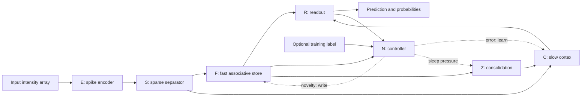

# Architecture

[Documentation index](README.md) · [Python API](API.md) · [Research protocol](RESEARCH_BENCHMARK.md)

MNEMA combines fast associative learning with slower adaptive synapses. This guide describes the current NumPy implementation, including where it differs from the broader architectural motivation. The entry point is [MNEMA.step](../mnema/model.py).

## One sample through the system

Solid arrows show inputs or outputs. Dotted arrows describe control of training operations. Instrumentation is passed into selected component calls and accumulates software counters.

## Components and defaults

| Stage | Default representation | Behavior | Source |
| --- | --- | --- | --- |
| E: encoder | `[16, 784]` uint8 raster | Time-to-first-spike encoding with an adaptive threshold | [encoder.py](../mnema/encoder.py) |
| S: separator | 64 active indices | Random connectivity, eight inputs per unit, top-k selection and homeostasis | [separator.py](../mnema/separator.py) |
| F: FastStore | `[16384, 10]` int16 class weights, salience, timestamps | Sum active-row votes; write on novelty; evict low-salience rows | [store.py](../mnema/store.py) |
| C: cortex | Ten adaptive neuron states; four synaptic variables per connection | Gather active weights; update membrane/adaptation; learn through eligibility traces | [cortex.py](../mnema/cortex.py) |
| R: readout | Ten probabilities and one class index | Blend fast votes and cortex membrane values through a logistic gate | [readout.py](../mnema/readout.py) |
| N: controller | `nu`, `delta`, `sigma`, `phi` | Compute novelty and error; accumulate sleep pressure | [modulators.py](../mnema/modulators.py) |
| Z: consolidation | Up to 64 sampled store rows per invocation | Train cortex on one row at a time; decrease store salience | [consolidate.py](../mnema/consolidate.py) |
| X: instrument | Operation counts and technology-card projection | Count selected compute and traffic operations | [counters.py](../instrument/counters.py) |

### Encoding and separation

`MNEMA` constructs the TTFS encoder with 16 time bins. Each input is flattened, cast to float32, and min-max normalized. Pixels above the encoder threshold emit a spike; threshold homeostasis runs on every call. A delta encoder exists as a component option, but `MNEMA` does not select it by default.

The separator reduces the raster to whether each input spiked at least once. Consequently, spike timing does not propagate into the subsequent sparse code. It sums inputs through fixed random connectivity, subtracts adaptive thresholds, and selects the top 64 units. Of 16,384 units, 14,745 are in the default active pool; the remaining reserve units are excluded from selection.

Homeostatic thresholds and running rates continue to change during native inference. Random connectivity is fixed after construction, while those arrays are adaptive. Code overlap must be measured on actual inputs: the idealized `k^2 / N` overlap estimate is not a guarantee of class separation or freedom from interference.

### Fast associations and slow cortex

FastStore reads sum the class-weight rows indexed by the sparse code. Its confidence is the difference between the top two vote totals, divided by the absolute top vote plus a small stabilizer. Writes increment the target-class weight and salience at active rows. Budget enforcement removes rows with the lowest salience.

The cortex contains a single projection from sparse inputs to ten adaptive leaky integrate-and-fire output units. It gathers active columns of the visible synaptic weights, then updates membrane voltage and adaptation. Four coupled float32 synaptic planes provide the Benna-Fusi-inspired memory variables; the first plane supplies visible weights. The `hidden_dim` constructor argument is stored but does not create a hidden layer.

On the training path, dense eligibility traces decay and accumulate local credit. When the model's prediction is wrong, the cortex applies a local update and synaptic diffusion. These dense training operations are part of the implementation; sparse input selection does not make all computation sparse. This implementation alone does not establish a particular asymptotic memory-retention law.

### Arbitration and training control

The readout computes a logistic gate from FastStore confidence and cortex output familiarity, blends the two score vectors, and returns a softmax distribution. The controller then evaluates that prediction against an optional target.

Learning occurs only when `is_training=True` and a label is present:

1. Novelty above `0.15` triggers a FastStore write.
2. A prediction error triggers cortex learning.
3. Sleep pressure at or above `50.0` triggers consolidation and is reset afterward.

The returned prediction is produced **before** that call's learning updates. Controller field `sigma` is currently unused; its presence does not imply an implemented surprise-based learning-rate rule. The readout's `a2` parameter is also unused.

### Sleep consolidation

Consolidation samples occupied rows without replacement, with probability proportional to `salience ** 0.6`. For each sampled row, it derives a target from the row's largest class weight, constructs a **single-index** activation, resets cortex neuron/eligibility state, and trains the cortex. Salience decreases by two; weights are cleared if salience reaches zero.

This is synthetic replay of associations. The implementation does not retain complete historical 64-index codes or raw images for later sleep replay. A claim about stored 112-byte traces or non-invertible codes is not supported by this implementation.

## Inference is stateful

`model.step(x, is_training=False)` skips weight learning and eligibility maintenance, but still changes:

- encoder threshold and, for the delta encoder, its reference input;
- separator thresholds and running rates;
- cortex membrane and adaptation state;
- controller novelty, error, and sleep pressure.

Native predictions can therefore depend on earlier inputs. The [research evaluation adapter](../experiments/research_state.py) snapshots the inference-mutable state and restores it in `finally` after each image. It also preserves the trained checkpoint's membrane state, restores RNG state, checks the full attribute-state hash, and verifies final-checkpoint predictions in reverse test order.

This isolation belongs to the benchmark layer. `is_training=False` alone is not a held-out evaluation protocol. [API examples](API.md#checkpoint-isolated-prediction) show both entry points.

## Memory boundaries

At the default ten-class configuration, an occupied FastStore row uses 20 bytes of int16 weights, 4 bytes of float32 salience, and 4 bytes of uint32 timestamp: **28 bytes**. Eviction accounts for only **25 bytes**. The nominal 65,536-byte limit can therefore permit 73,388 bytes of active array payload in the recorded runs.

All FastStore arrays are allocated densely, occupying 458,752 bytes regardless of active content. Cortex and separator state are additional allocations. The reported total resident NumPy payload is 4,391,100 bytes. Neither the configured budget nor this array total represents peak process RAM.

See [memory accounting](RESEARCH_BENCHMARK.md#memory-and-energy-accounting) for the distinction between adaptive state, fixed scaffold, active content, and allocated capacity. All research replay buffers also have fixed capacities; they should not be described as unbounded.

## Operation counts and energy

The instrument increments counters explicitly at selected code locations. It is not an automatic profiler of every NumPy operation. Default native inference records zero dense MACs, while other arithmetic and data movement still occur.

`project_energy()` sums the supported counter terms against the selected YAML card and always returns `is_measured=False`. The current formula includes SRAM/DRAM read terms but does not charge the corresponding write counters. Other omissions include portions of arithmetic and research checkpoint restoration. A projected value is neither device power consumption nor a measured deployment advantage.

Changing technology cards changes the cost model; it does not execute the model on that hardware. The [research report](RESEARCH_BENCHMARK.md) intentionally avoids a complete cross-method training-energy ranking.
