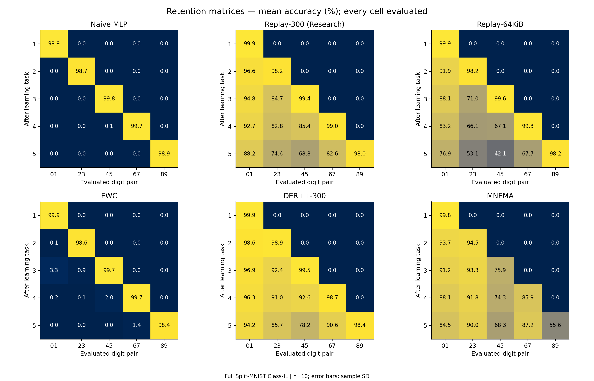

# Completed full-data benchmark

[Project overview](../../../README.md) · [Research protocol](../../../docs/RESEARCH_BENCHMARK.md) · [Artifact guide](../../README.md)

**Status: complete. All 60 seed-method runs are present.** This directory contains the full Split-MNIST report bundle supplied in `cognx_benchmarking`, copied into the repository so its reports, figures, and evidence can be read together.

The experiment uses all 60,000 training images and 10,000 test images, five sequential digit-pair tasks, six methods, and seeds 0-9. The configuration was created on September 11, 2026. The original validation reports all saved artifacts valid. A separate import audit checked the saved data without rerunning training or inference.

## Read the results

| Artifact | Purpose |
| --- | --- |
| [BENCHMARK_REPORT.md](BENCHMARK_REPORT.md) | Complete original report: setup, methods, findings, memory, energy, and limitations |
| [Summary table](summaries/summary_table.md) | All methods, mean/SD, detailed array-memory categories, and projected inference |
| [Summary CSV](summaries/summary.csv) | Spreadsheet-ready aggregate values |
| [Summary JSON](summaries/summary.json) | Machine-readable means, SD, retention curves, memory, runtime, and completion coverage |
| [config.json](config.json) | Exact settings, data/source hashes, software, and source commit |
| [status.json](status.json) | Original `complete` / `research_complete` flags |
| [validation.json](validation.json) | Original saved-artifact validation for all 60 runs |
| [raw/](raw/) | 60 pair records, ten index records, and a combined record |
| [full_results.json](full_results.json) | Combined configuration and all run records |
| [workers/](workers/) | 60 records of distributed worker provenance |

`summaries/README_SECTION.md` is an original generated fragment intended for the repository root. Its links resolve correctly when embedded there; use the full report for standalone reading.

## Main findings

| Method | Final ACC (%) | Forgetting (pp) | Resident array payload (bytes) |
| --- | ---: | ---: | ---: |
| Naive MLP | 19.79 +/- 0.06 | 99.52 +/- 0.12 | 814,120 |
| Replay-300 (Research) | 82.44 +/- 1.33 | 20.58 +/- 1.62 | 1,049,636 |
| Replay-64KiB | 67.59 +/- 2.07 | 39.30 +/- 2.60 | 879,291 |
| EWC | 19.98 +/- 0.36 | 99.12 +/- 0.40 | 7,327,080 |
| DER++-300 | 89.39 +/- 0.60 | 12.12 +/- 0.73 | 1,061,636 |
| MNEMA | 77.12 +/- 0.87 | 6.53 +/- 1.41 | 4,391,100 |

Accuracy and forgetting are mean +/- sample SD over ten seeds. MNEMA has the lowest observed mean forgetting, while DER++-300 has the highest accuracy. Replay-300 and DER++-300 both have higher accuracy and smaller resident allocations than MNEMA. These descriptive rankings do not establish statistical significance.

The reported native inference projection is 0.316 microjoules/image for MNEMA and 1.768 for each dense baseline. It is incomplete and is not measured physical energy. There is no comparable end-to-end training-energy ranking.

MNEMA's configured 64 KiB FastStore threshold undercounts actual row payload. Active content reaches 73,388 bytes, with 597,911 post-sample exceedance observations over ten runs. Resident arrays include substantial state beyond FastStore; their payload excludes Python/runtime overhead, data, and temporary workspace. See the [accounting boundaries](../../../docs/RESEARCH_BENCHMARK.md#memory-and-energy-accounting).

## Figures

All six plot families are supplied in both PNG and PDF. These are the original full-data figures, not the earlier quick-run plots.

| Figure | PNG preview | PDF |
| --- | --- | --- |
| Final accuracy | [PNG](plots/final_accuracy.png) | [PDF](plots/final_accuracy.pdf) |
| Forgetting | [PNG](plots/forgetting.png) | [PDF](plots/forgetting.pdf) |
| Accuracy versus resident memory | [PNG](plots/accuracy_vs_memory.png) | [PDF](plots/accuracy_vs_memory.pdf) |
| Forgetting versus resident memory | [PNG](plots/forgetting_vs_memory.png) | [PDF](plots/forgetting_vs_memory.pdf) |
| Retention matrices | [PNG](plots/retention_matrices.png) | [PDF](plots/retention_matrices.pdf) |
| Continual-learning progress | [PNG](plots/continual_learning_progress.png) | [PDF](plots/continual_learning_progress.pdf) |

## Provenance and reproduction

| Field | Value |
| --- | --- |
| Configuration ID | `ab869e57feea62e93198f72fedde18182dc93a28a72d4875e966067d676027a8` |
| Recorded source commit | `fe86ec1c6abc600dda8ec50565a551af4e5434bd` |
| Reference software | Python 3.11.7; NumPy 2.2.6; Matplotlib 3.10.3; PyYAML 6.0.2 |
| Execution | GitHub Actions CPU workers; one BLAS thread; independent seed-method jobs |
| Original files imported | 152 files, approximately 124 MiB |

[IMPORT_MANIFEST.json](IMPORT_MANIFEST.json) records each supplied file's original byte count and SHA-256 hash. The report, JSON, CSV, plots, and worker records are unmodified copies; the parent originals remain untouched. The manifest, [IMPORT_VALIDATION.json](IMPORT_VALIDATION.json), and this index are additional repository records. Git attributes disable line-ending conversion within this directory to preserve the original bytes.

The import audit checked configuration and dataset digests; exact full-protocol indices for all ten seeds; 60 unique pairs; raw/combined equality; result digests; saved predictions against task accuracy and forgetting; recorded state isolation/reverse-order checks; memory accounting; worker identity; and the aggregate summary. Checking recorded state-isolation assertions is not the same as rerunning model inference. `training_rerun` and `inference_rerun` are both false.

**Current-source limitation:** at import time, `experiments/run_research_benchmark.py` did not match its recorded source hash even after line-ending normalization, and eighteen additional source files differed only in CRLF/LF encoding. The subsequent Apache 2.0 migration updates source license headers, introducing additional hash differences without changing model behavior. `IMPORT_VALIDATION.json` preserves the original import-time observations. Consequently the unmodified standard validator and resume logic reject this bundle on this checkout. This does not change the successful saved-artifact consistency checks, but it prevents a claim of exact reproduction with the current source.

Read the existing report without launching a run. To reproduce the original experiment, restore the recorded source bytes and software environment and follow the [runbook](../../../experiments/RESEARCH_BENCHMARK.md). To run the current revision, use a separate checkout/output context or deliberately archive the existing mode directory with `--force`; that creates a new experiment with its own provenance. Do not edit recorded hashes to bypass the checks.

## Preserve and update

Treat the imported files as an evidence snapshot. Their original report retains the reproduction and future-work wording written for that run. Current documentation treats full Split-MNIST as completed; another dataset or task order is a potential follow-up, not completed evidence.

Use working copies for regenerated reports/figures so this import remains verifiable. Keep original and regenerated outputs distinguishable. The [quick report](../quick/BENCHMARK_REPORT.md) and [historical tables](../../ALL_TABLES.md) remain separate records with different scope and evaluation semantics.
